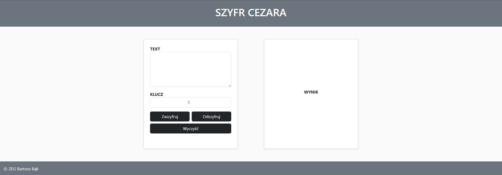

# 🔐 Szyfr Cezara

Interaktywna aplikacja webowa umożliwiająca szyfrowanie i deszyfrowanie tekstu przy użyciu klasycznego szyfru Cezara.  
Aplikacja działa w przeglądarce i pozwala przekształcać tekst poprzez przesunięcie liter w alfabecie o wybraną wartość.

---

## 📌 Opis projektu

Projekt został wykonany w celu utrwalenia wiedzy z zakresu:

- podstaw kryptografii  
- algorytmów szyfrowania  
- operacji na łańcuchach znaków  
- manipulacji elementami DOM w JavaScript  

Użytkownik może wpisać dowolny tekst oraz podać klucz (liczbę przesunięcia), a aplikacja automatycznie szyfruje lub deszyfruje wiadomość.

---

## ⚙️ Funkcjonalności

- ✅ Szyfrowanie tekstu szyfrem Cezara  
- ✅ Deszyfrowanie tekstu  
- ✅ Obsługa dowolnej długości tekstu  
- ✅ Zachowanie znaków specjalnych (spacje, cyfry, symbole)  
- ✅ Obsługa różnych wartości klucza  
- ✅ Czytelny i prosty interfejs  

---

## 🛠️ Technologie

- HTML5  
- CSS3  
- JavaScript  

---

## ▶️ Jak uruchomić projekt

1. Sklonuj repozytorium:

2. Otwórz plik `index.html` w przeglądarce.

Projekt nie wymaga instalacji ani dodatkowych narzędzi.

---

## 📷 Podgląd aplikacji

---

## 🧠 Jak działa aplikacja?

1. Użytkownik wpisuje tekst do zaszyfrowania lub odszyfrowania  
2. Podaje klucz (liczbę całkowitą)  
3. Program analizuje każdy znak tekstu  
4. Litery są przesuwane w alfabecie o podaną wartość  
5. Znaki spoza alfabetu pozostają bez zmian  
6. Wynik wyświetlany jest na ekranie  

---

## 📂 Struktura projektu

Szyfr-Cezara/
│
├── index.html
├── style.css
├── script.js
├── screenshot.png
└── README.md

---

## 🚀 Możliwe ulepszenia

- Obsługa wielkich i małych liter osobno  
- Obsługa polskich znaków (ą, ę, ł, ś itd.)  
- Historia szyfrowania  
- Eksport wyników do pliku  
- Tryb ciemny (dark mode)  
- Wersja responsywna (mobile)  

---

## 👨‍💻 Autor

Bartosz Bąk  
GitHub: https://github.com/BartBak1507  
